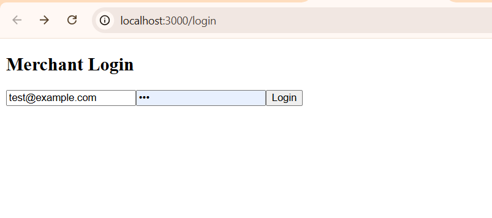
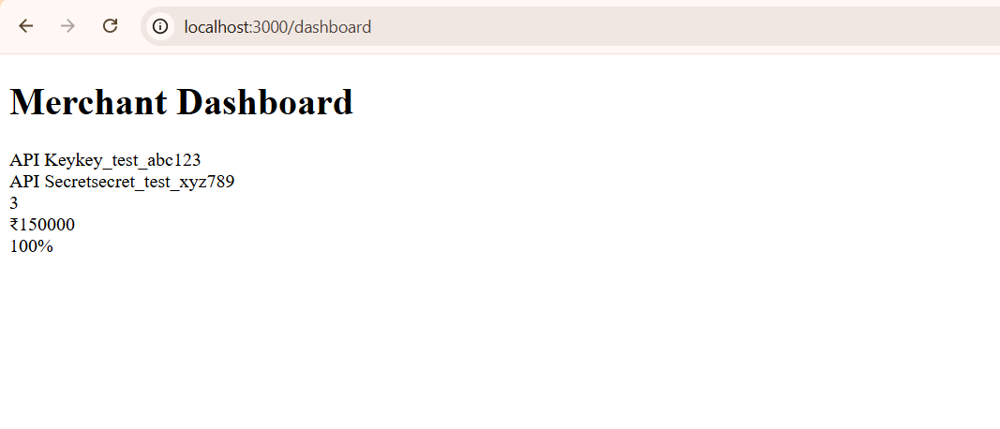
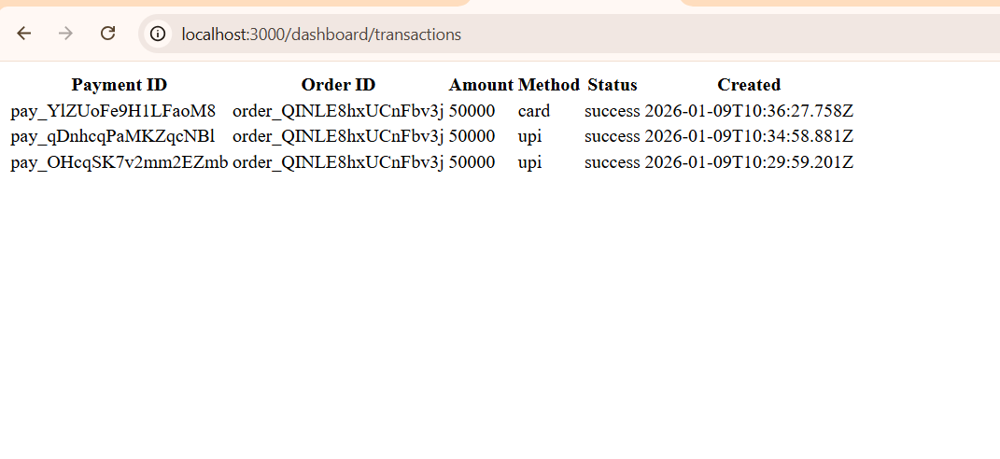
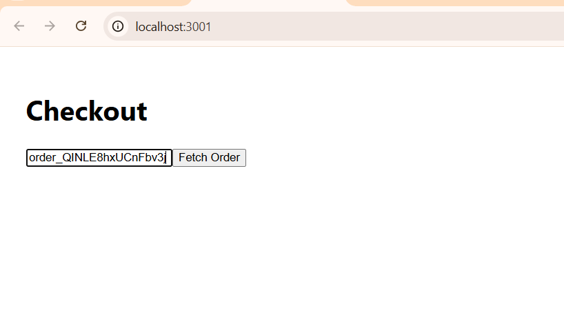
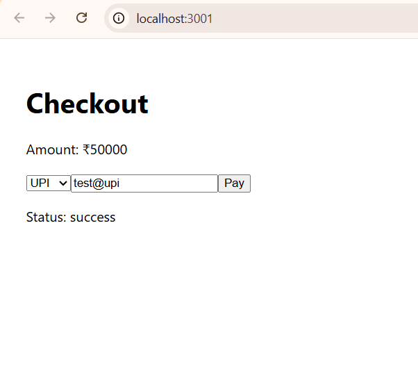
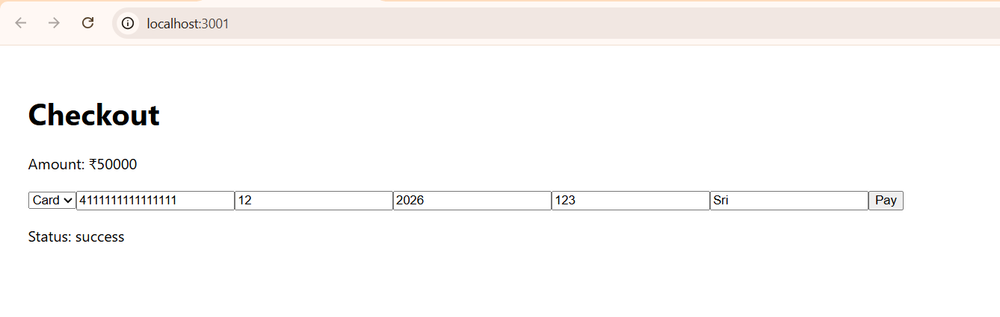

# Payment Gateway – Full Stack Assignment

A complete payment gateway system with backend APIs, merchant dashboard, and public checkout flow.  
The project is fully Dockerized and ready for evaluation.

---

## Tech Stack

- Backend: Node.js, Express
- Frontend (Dashboard): React
- Checkout App: React
- Database: PostgreSQL
- Containerization: Docker, Docker Compose

---

## Services & Ports

| Service | Description | Port |
|-------|------------|------|
| API | Backend REST APIs | 8000 |
| Dashboard | Merchant Dashboard | 3000 |
| Checkout | Public Checkout Page | 3001 |
| PostgreSQL | Database | 5432 |

---

## How to Run the Project

```bash
docker-compose up -d --build
```
No local setup is required. All services run using Docker.

**This command will start:**

PostgreSQL

Backend API

Merchant Dashboard

Checkout App

## Test Merchant Credentials

**Used internally by the system and for API testing:**

API Key: key_test_abc123
API Secret: secret_test_xyz789


## API Endpoints

Health Check
GET /health

Orders
POST /api/v1/orders
GET /api/v1/orders/:order_id
GET /api/v1/orders/:order_id/public

Payments
POST /api/v1/payments
POST /api/v1/payments/public
GET /api/v1/payments
GET /api/v1/payments/:payment_id

Dashboard Stats
GET /api/v1/stats/dashboard

## Frontend Routes (Dashboard)

/login

/dashboard

/dashboard/transactions

All required data-test-id attributes are present for automated testing.
Routes are protected using API Key & Secret set at login.


## Checkout

Public checkout is available at:

http://localhost:3001


## Features:

Fetch order by Order ID

UPI payment

Card payment

Payment status display

## Dockerized Architecture

All services are containerized and orchestrated using Docker Compose.

To stop services:

docker-compose down

## Screenshots

### Merchant Dashboard

**Login Page**


**Dashboard Home**


**Transactions Page**


### Checkout Flow

**Checkout Page**


**UPI Payment**


**Card Payment**



## Demo Video

A complete demo showing:
- Order creation via API
- Checkout flow
- Successful payment

📽️ Video Link:  
https://drive.google.com/file/d/1gK6qeXw1nnajObNd3_IE7FLmR7ZSbEjA/view?usp=sharing


## Notes

Login is dummy as per instructions

Backend authentication uses API Key & Secret

Database is seeded with a test merchant

Project is ready for automated evaluation

This project follows the provided assignment overview and instructions.
